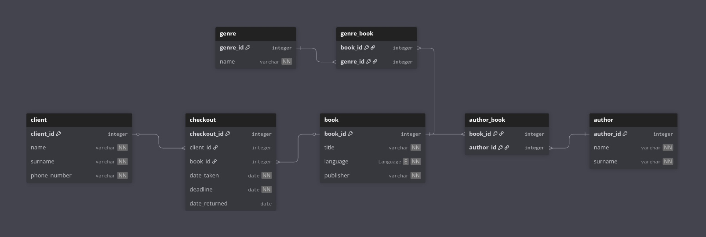
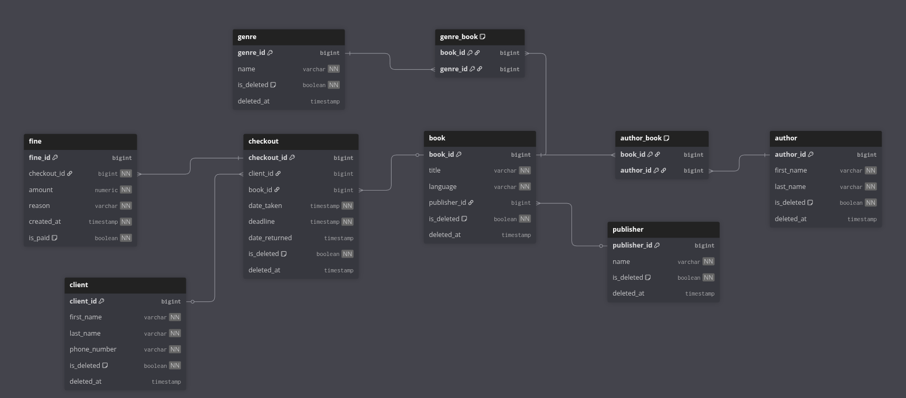

# Library Manager

**Library Manager** — це Java-додаток для управління бібліотечною базою даних. Він дозволяє зберігати всю необхідну інформацію про:  

- Книги  
- Авторів  
- Жанри  
- Видавництва  
- Клієнтів та їхні дані  
- Позики книг 
- Штрафи за прострочені повернення  

## Основний функціонал

- Додавання, редагування та видалення книг, авторів, клієнтів, видавництв та жанрів  
- Ведення історії позик книг клієнтами  
- Автоматичний розрахунок штрафів за прострочене повернення книг  
- Пошук і фільтрація книг та клієнтів  
- Збір статистики

## Використаний стек технологій

- **Java**  
- **Spring Boot**  
- **Spring Data JPA + Hibernate**
- **PostgreSQL**
- **Flyway**
- **Docker**
- **Maven** 

## Встановлення та запуск

1. Склонуйте репозиторій:  
```bash
git clone https://github.com/v14cl/db-coursework.git
```
Запустіть міграції Flyway:

```bash
mvn flyway:migrate
```
Запустіть додаток:

```bash
mvn spring-boot:run
```

# Більше про схему БД:
---

## Основні сутності:

* Publisher
* Book
* Author
* Genre
* Client
* Checkout

Зв’язки:

* Книга ↔ Автор — багато-до-багатьох - враховую, що у книги може бути декілька авторів
* Книга ↔ Жанр — багато-до-багатьох - часто у книги декілька жанрів одночасно
* Видавництво → Книга — один-до-багатьох - у кожної книги тільки одне видавництво
* Клієнт → Видача — один-до-багатьох
* Книга → Видача — один-до-багатьох
* **Видавництво → Штраф** — один-до-багатьох

<br>
> В кожному чеку по одній книзі і клієнту. 
> Якщо клієнт бере декілька книг одночасно, ми створюємо декілька чекаутів
> Якщо книгу він повертає невчасно, йому автоматично створюється штраф

## Опис таблиць

### `publisher`

**Видавництва**

| Стовпець     | Тип     | Обмеження        | Опис                                 |
| ------------ | ------- | ---------------- | ------------------------------------ |
| publisher_id | SERIAL  | PK               | PK видавництва                       |
| name         | VARCHAR | NOT NULL, UNIQUE | Назва видавництва                    |

---

### `book`

| Стовпець     | Тип      | Обмеження                                          | Опис        |
|--------------|----------|----------------------------------------------------|-------------|
| book_id      | SERIAL   | PK                                                 | PK книги    |
| title        | VARCHAR  | NOT NULL                                           | Назва       |
| language     | Language | NOT NULL, ENUM (`English`, `Ukrainian`, `French`)  | Мова        |
| publisher_id | INTEGER  | FK → publisher.publisher_id, NOT NULL              | Видавництво |


---

### `client`

| Стовпець     | Тип     | Обмеження        | Опис                      |
| ------------ | ------- | ---------------- | ------------------------- |
| client_id    | SERIAL  | PK               | PK клієнта                |
| first_name   | VARCHAR | NOT NULL         | Ім’я клієнта              |
| last_name    | VARCHAR | NOT NULL         | Прізвище клієнта          |
| phone_number | VARCHAR | NOT NULL, UNIQUE | Номер телефону            |

---

### `author`

| Стовпець   | Тип     | Обмеження | Опис                 |
| ---------- | ------- | --------- | -------------------- |
| author_id  | SERIAL  | PK        | PK автора            |
| first_name | VARCHAR | NOT NULL  | Ім’я автора          |
| last_name  | VARCHAR | NOT NULL  | Прізвище автора      |

---

### `genre`

| Стовпець | Тип     | Обмеження        | Опис                |
| -------- | ------- | ---------------- | ------------------- |
| genre_id | SERIAL  | PK               | PK жанру            |
| name     | VARCHAR | NOT NULL, UNIQUE | Назва жанру         |

---

### `author_book`

| Стовпець  | Тип     | Обмеження                 | Опис  |
| --------- | ------- | ------------------------- | ----- |
| book_id   | INTEGER | PK, FK → book.book_id     | Книга |
| author_id | INTEGER | PK, FK → author.author_id | Автор |

**Первинний ключ:** складений (`book_id`, `author_id`)

---

### `genre_book`

| Стовпець | Тип     | Обмеження               | Опис  |
| -------- | ------- | ----------------------- | ----- |
| book_id  | INTEGER | PK, FK → book.book_id   | Книга |
| genre_id | INTEGER | PK, FK → genre.genre_id | Жанр  |

**Первинний ключ:** складений (`book_id`, `genre_id`)

---

### `checkout`

**Зберігає інформацію про видачу книг клієнтам**

| Стовпець      | Тип     | Обмеження             | Опис                          |
| ------------- | ------- | --------------------- | ----------------------------- |
| checkout_id   | SERIAL  | PK                    | PK видачі                     |
| client_id     | INTEGER | FK → client.client_id | Клієнт                        |
| book_id       | INTEGER | FK → book.book_id     | Книга                         |
| date_taken    | DATE    | NOT NULL              | Дата видачі                   |
| deadline      | DATE    | NOT NULL              | Дедлайн                       |
| date_returned | DATE    | NULL                  | Фактична дата повернення      |

date_returned може бути null, поки книга не повернена.
По date_returned з null ми в майбутньому і будемо знаходити книги, які ще не повернені.

### `fine`

| Стовпець     | Тип         | Опис |
|--------------|-------------|------|
| fine_id      | BIGINT      | PK штрафу |
| checkout_id  | BIGINT      | FK → checkout.checkout_id |
| amount       | NUMERIC     | Сума штрафу |
| reason       | VARCHAR     | Причина штрафу |
| created_at   | TIMESTAMP   | Дата створення |
| is_paid      | BOOLEAN     | Статус оплати |


<br>
<br>
<br>

# Нормалізація

## Cхема до нормалізації
<br>



## Для усунення дублювання інформації(видавництв в книгах), я виніс видавництво в окрему таблицю
<br>


<br>

Cхема відповідає вимогам **3НФ**:
<br>

* Всі атрибути є атомарними
* Відсутні часткові залежності
* Відсутні транзитивні залежності
* Дані не дублюються між таблицями
---


